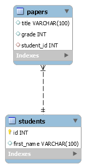

# School-database
### I made this code, connecting python with MySQL, to help someone who want to know. 

In this file, i will show how this code works, and for this, i will divid my explanation in 3 parts:
1. Introduce a diagram of the tables from the database
2. Show all the functionalities of the code
   * An image of the result of a corresponding function
   * The functions itself
3. Show all that packages and programs that you will need

1) **Diagram**

2) **Functions and their results**
    * _Insert_Many_Into_students_
    
        ID| First_name
        --|-----------|
        1 |   Caleb   |
        2 |  Samantha |
        3 |    Raj    |
        4 |   Carlos  |
        5 |    Lisa   |
          
   * Insert_Many_Into_papers
   
        Title| Grade | Student_id|
        -----|-------|-----------|
        Borges and Magical Realism|89|4|
        Russian Lit Throught The Ages|94|2|
        De Montaigne and The Art of The Essay|98|2|
        My First Book Report|60|1|
        My Second Book Report|75|1|
        
    * students_table
    
        First_name| Title | Grade|
        -----|-------|-----------|
        Caleb|My First Book Report|60|
        Caleb|My Second Book Report|75|
        Samantha|Russian Lit Throught The Ages|94|
        Samantha|De Montaigne and The Art of The Essay|98|
        Raj|MISSING|0|
        Carlos|Borges and Magical Realism|89|
        Lisa|MISSING|0|
       
     * Grade_Average
      
        First_name|Average
        ----------|-------|
        Samantha |96.0000|
        Carlos |89.0000|
        Caleb |67.5000|
        Raj|0.0000|
        Lisa |0.0000|
        
     * Status (2ª version of Grade_Average)
        
        First_name|Average|Passing_status
        ----------|-------|-------------|
        Samantha |96.0000|PASSING|
        Carlos |89.0000|PASSING|
        Caleb |67.5000|FALLING|
        Raj|0.0000|FALLING|
        Lisa |0.0000|FALLING|
       
       
3) Downloads

    MySQL Workbench | 
    ------------ |
    [MySQL](https://dev.mysql.com/downloads/workbench/) | 
 
    Pymysql | 
    ------------ |
    [pip install PyMySQL](https://pypi.org/project/PyMySQL/) | 
     

:pushpin:**OBS:** I hope that i had helped you
